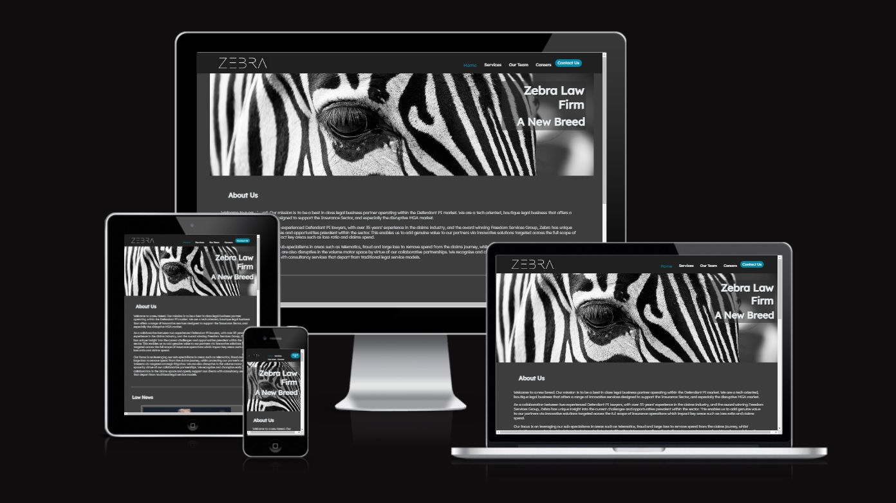
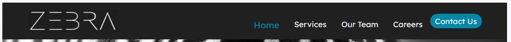
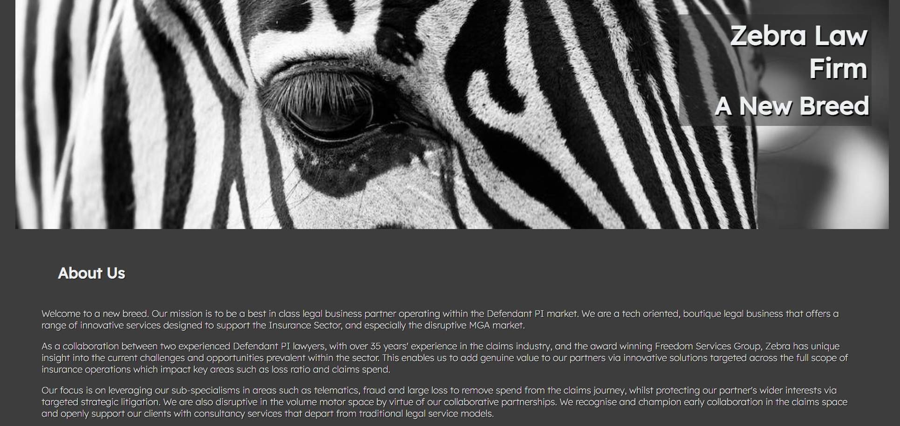
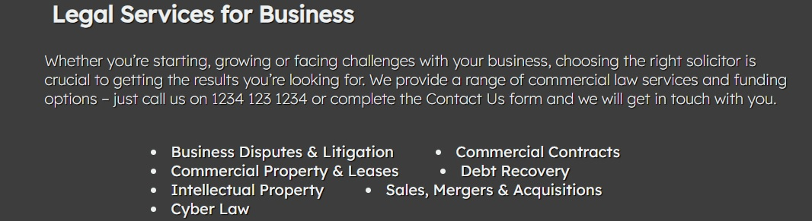
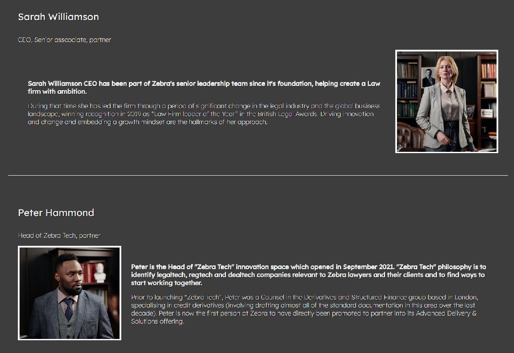
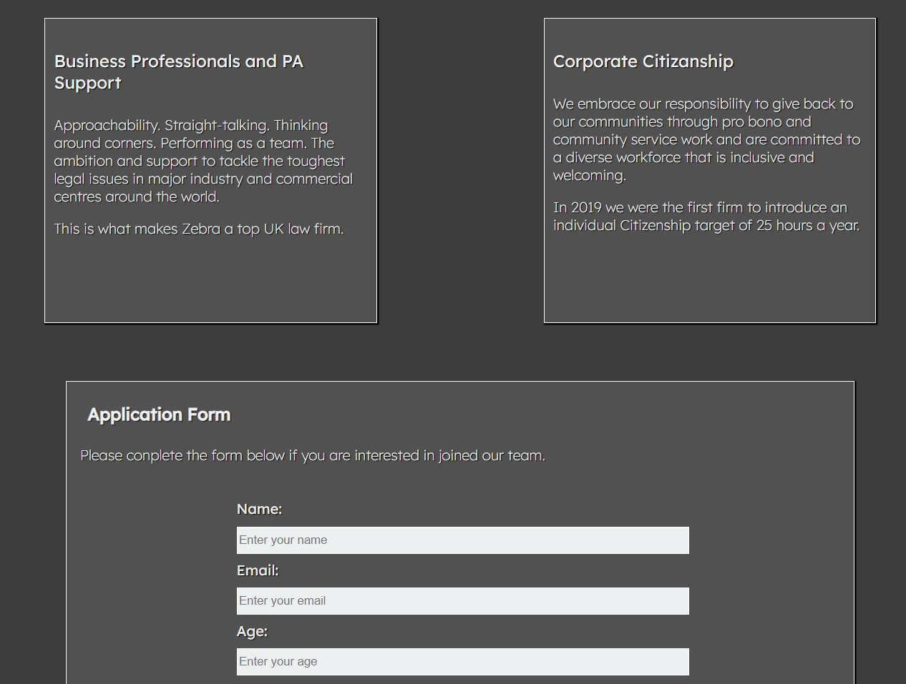
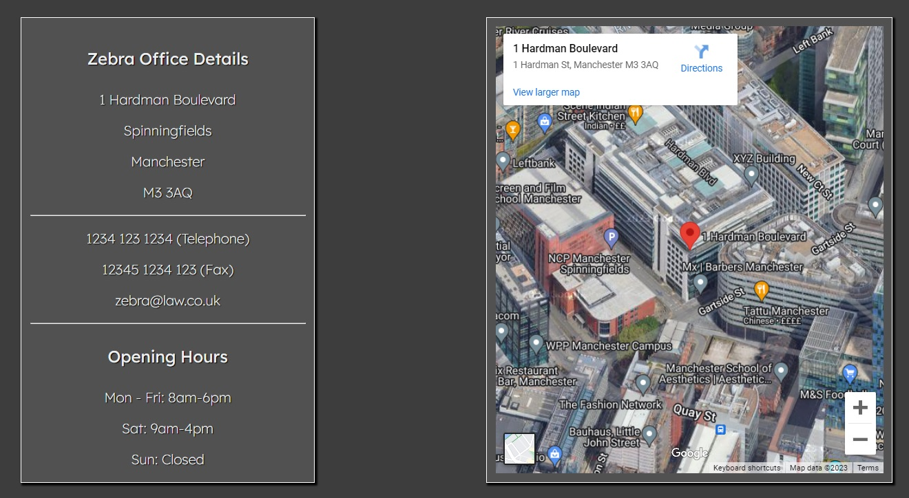

# ZEBRA LAW   

The [Zebra Law Firm](https://cniblock.github.io/Project_1/index.html) website is a multi-page website for a new Law Firm.
Providing users information about the firm, it shows what services the firm can provide, introduces the team at the firm, provides career information and contact details.
The inspiration for this is a family members new law firm.

### USER GOAL
To clearly see what the Law Firm's services are.
What the philosophy of the firm is.
Who the CEO's are and colleagues they work with and also the career information of both.
Users will be able to fill out a form if they are interested in a career with the firm.
Contact information and office details / map will be available on the website.

### SITE OWNER GOALS
To have a fully functional and customised website that can go more in depth than Linkedin and also have more of a personal touch.
It will allow the owner to look professional and give the option of users to contact them and start communication channels.

## FEATURES OF THE WEBSITE

### Navigation

* The Nav bar has the company Logo on the top left.
* Page Links are in the middle of the header, slightly offset to the right.
* There is a "contact us" button on the right of the header.
* The Page Links have a "hover" animation and an "active" animation - lighting up in blue colour when hovered and once clicked will stay blue so users know what page they are on.
* The nav bar changes size and is readable when changing dimensions.

### Home - landing page.

* Contains a header Image with company name and company slogan.
* The Name of the Firm and picture of a Zebra is a metaphor for the law being "black and white"
* A section explaining what the company does and who they are.
* A News section showing 4 top Law News stories - with links to external news pages.

### Services. 

* What the services company can provide.
* 2 sections, one showing personal services and the other section showing business services. 

### Team.

* The team page has a team photo after the header hero image.
* 4 Members of the team are showcased with an individual photo and personal experience text.
* There is also job role and position information under their names.
* 

### Career Page. 

* The career page contains an introduction followed by 4 career content boxes - showing the careers available.
* There is a form on the career page that users can use to apply for positions at the firm.

### Contact Us page.

* The "contact Us" page has some information on the firm followed by the Office details and opening times.
* A Google Maps address has been embedded onto the page.

### Footer.

The footer contains the company name and copyright symbol.
The social media links are contained in the footer and are click-able.

## Testing

### Validator Testing

### Accessability 

### Unfixed Bugs

## Deployment

## Credits

### Content

### Media

## Other Project Advice